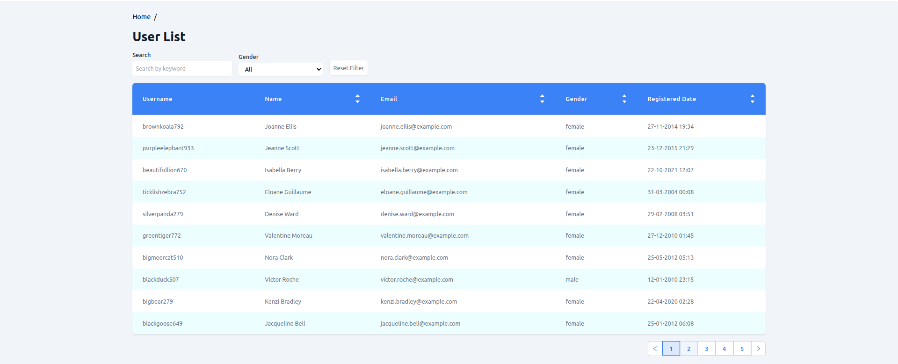

# nextjs-dashboard-app

> Simple Dashboard app build with Nextjs + Typescript + @Redux/toolkit + tailwind and some more.
> See live demo here [nextjs-dashboard-app](https://nextjs-dashboard-app.vercel.app/).

## Preview Project



## Table of Contents

- [nextjs-dashboard-app](#nextjs-dashboard-app)
  - [Preview Project](#preview-project)
  - [Table of Contents](#table-of-contents)
  - [General Information](#general-information)
  - [Technologies Used](#technologies-used)
  - [Project Structure](#project-structure)
  - [Setup](#setup)
  - [Usage](#usage)
  - [Project Status](#project-status)
  - [Room for Improvement](#room-for-improvement)
  - [Contact](#contact)

## General Information

This project is intended as a private playground to explore more about Frontend techstacks and tools and its compatibility to each other. I made this project to also for trying new things and research some new FE technology in the future.

## Technologies Used

- [Nextjs](https://nextjs.org/) - version 12.2.5
- [Typescript](https://www.typescriptlang.org/) - version 17.0.0
- [@Redux/toolkit](https://redux-toolkit.js.org/) - version 1.8.5
- [Tailwindcss](https://tailwindcss.com/) - version 3.1.8
- [Jest](https://jestjs.io/) - version 27.5.1
- [React testing library](https://testing-library.com/docs/react-testing-library/intro/) - version 12.1.3
- [React Icons](https://react-icons.github.io/react-icons/) - version 4.4.0
- [Typescript Airbnb ESLint](https://www.npmjs.com/package/eslint-config-airbnb-typescript) - version 17.0.0
- [Mock Service Worker](https://mswjs.io/) - version

## Project Structure

```bash
root
└── _src
   ├── __tests__
   |       |
   |       ├── _components
   |       |   └── _Button.spec.tsx
   |       |
   |       └── _features
   |           └── _UserList
   |               ├── __snapshots__
   |               |
   |               └── UserList.spec.tsx
   |
   ├── _api
   |    └───── _user
   |           ├── _index.ts
   |           └── _models.ts
   |
   ├── _components
   |           └── _Button
   |               └── _component.tsx
   |
   ├── _features
   |           └── _UserList
   |               ├── _components
   |               |        ├── _filter.tsx
   |               |        └── _columns.tsx
   |               ├── _View.tsx
   |               └── _ViewModel.ts
   |
   ├── _hooks
   |
   ├── _pages
   |   └── _UserList/[id]/[...slug].tsx
   |
   ├── _store
   |   └── _slices
   |       ├── _filter.ts
   |       └── _users.ts
   |
   ├── _styles
   |
   └── _utils

```

## Setup

Requirements:

```bash
// consider using nvm to manage your node version
node v16.17.0
yarn v1.22.19
npm v8.15.0
```

Installation:

```bash
// run this command to start run the project:

yarn install
yarn dev
```

Set your .env variables:

```bash
NEXT_PUBLIC_API_URL=https://randomuser.me/api/
NEXT_PUBLIC_API_SEED=8613232dc211323c
```

If something wrong happened and can't run the project, try this steps:

- remove `.next` folder in root folder.
- remove `node_modules` folder.
- re-run the installation or [Setup steps](#setup).

## Usage

There is several command that you might need to know to run some features in this project

- Run test case: `yarn test`
- Build project: `yarn build`
- Check ESLint errors: `yarn lint`
- Autofix ESLint errors: `yarn lint:fix`
- Prepare husky integration: `yarn prepare`

If there is trouble of your test case failing or you can't commit your changes,
it might be caused by unmatched **snapshots**. try run this command to update the test snapshots:

```bash
// to update test __snapshots__
yarn test -u

// re-run git commit if needed
git commit -m "<action_type_here>(<changes_type_here>): <commit_comment_here>"
```

## Project Status

Project is: **_in progress_**

## Room for Improvement

After reviewing the project there is several things that can be improved, here's what can be improved next:

Room for improvement:

- Add more test cases
- Should consider adding [Cypress](https://www.cypress.io/) e2e test case

To do:

- Consider mock development

## Contact

Created by [@fuadbaskara](https://www.linkedin.com/in/fuad-baskara-b07ab7164/) - contact me on linkedin!
